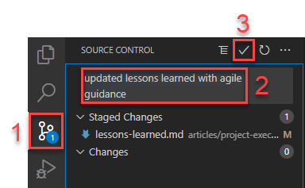
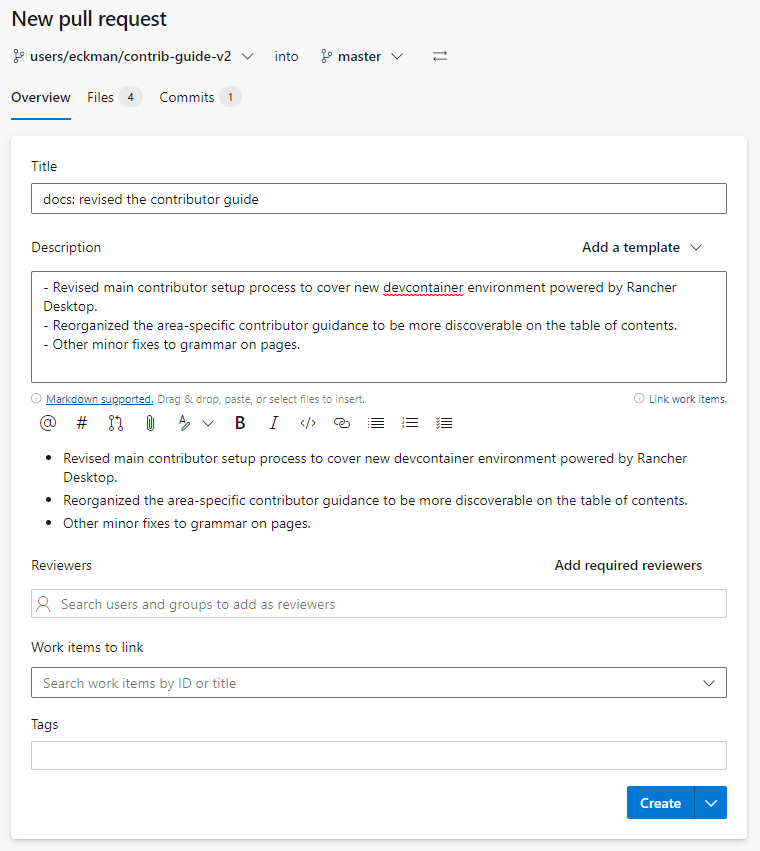
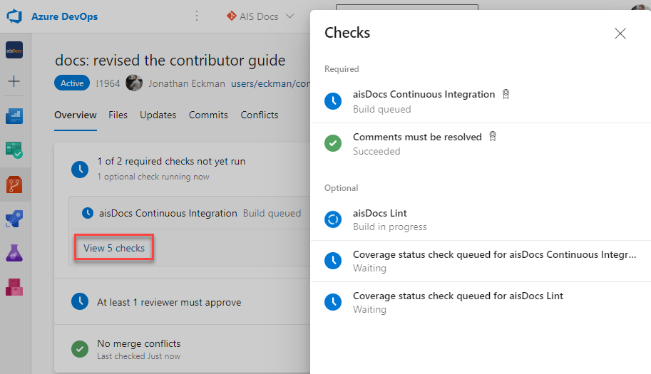

# How to contribute to PACE Docs

Developing, testing, and submitting a contribution to PACE Docs is easy. Follow the steps described in this article to setup your workstation, make a change, and submit it for review.

## Install the required tools

You must install several tools on your workstation before beginning. This is a one time setup step.

1. Install [Git](https://git-scm.com/).
1. Download and install [Visual Studio Code](https://code.visualstudio.com/).

## Clone the repository

You must clone the PACE git repository to your workstation. This is a one time setup step.

1. Open Visual Studio Code.
2. Open the [Command Pallette](https://code.visualstudio.com/docs/getstarted/userinterface#_command-palette) by:
   - Pressing Ctrl + Shift + P on Windows
   - Pressing Command + Shift + P on Mac
   - Clicking **Command Pallette** in the **View** menu item of VS Code.
3. Search for and select the command "Clone repository in named container volume".
4. When prompted to provide the repository URL, input the PACE Docs git repo URL then press Enter.

   ```cmd
   https://InsuranceCo.visualstudio.com/PACE%20and%20PURE/_git/PACE%20and%20PURE
   ```

## Create a working branch

After you have cloned the repository, you will initially have the **master** branch checked out. You will not be able to commit changes directly to this branch and will instead need to create a working branch that will hold all of your changes until it comes time to publish your work to the PACE Docs website.

## Create content

You are now set up and ready to author content in PACE Docs. Content in PACE Docs is written in markdown. Follow this process to author and preview your markdown content.

1. In VS Code, open the **Explorer** from the left vertical navigation bar.

   

1. Open the existing file you want to edit or add a new file. When adding new files, the filename must follow the kebab naming convention of all lowercase letters with dashes for spaces. For example, **my-new-pace-docs-article.md**.
1. Edit the markdown contents of your file. For assistance with writing high-quality markdown content, review the [markdown reference guide](ContributorGuidance/markdown-reference.md) and [style guide](ContributorGuidance/style-guide.md).
1. As you work, don't forget to save the changes you make to files using Ctrl + S on Windows, Command + S on Mac, or using **Save** under the **Files** menu in Visual Studio Code.
1. As you work, you can preview your content using either the Visual Studio Code markdown preview or by rebuilding your locally running instance of PACE Docs. Review the [Preview your content](ContributorGuidance/preview-content.md) article to learn how to use these options.

This is the general content creation process for the majority of PACE Docs. For more specific guidance on how to create content within a given area of PACE Docs, including best practices, templates, and other time-savers, continue reading the relevant articles in this section of the Contributor Guide.

## Commit and push your changes

As you progress through the development of your content, you should regularly commit and push your change to the remote repository on Azure DevOps. As a rule of thumb, you should do this whenever you reach a good milestone or stopping point in your development or once a day - whichever is more frequent. By pushing your progress to the remote repository in small, frequent batches, you are backing your work up in case your local copy is lost for any reason or in case you simply want to revert to an older version of your content.



1. In VS Code, open the **Source Control** explorer from the left vertical navigation.
1. Within the commit message text box, input a brief description of the set of changes you are committing. For example, "updated lessons learned with agile guidance".
1. Click the **commit** button.
1. After you have committed your changes, you will see either a **Publish Branch** or **Sync Changes** button in the Source Control explorer. Click this button.

   

Remember, you must complete this process at least once at the end of your work but doing it continuously throughout your development is a good practice.

## Peer review

The final step of the contribution process is to submit your change for peer review. This is done using a "pull request" within Azure DevOps.

1. Browse to the [**Pull Requests** page](https://InsuranceCo.visualstudio.com/_git/PACE%20and%20PURE/pullrequestcreate) of the PACE Docs Azure DevOps project.
1. On the **New Pull Request** form, select your branch from the source branch drop down (the left) and **master** from the target drop down (the right).

   

1. In the **Title** field, input a short name for your changes.
1. In the and **Description** field, provide a brief description of your changes to help the reviewer understand your intent.
1. (Optional) If there are any team members or subject matter experts you'd like to review your changes, add them as reviewers. The **PACE Docs Maintainers** team will automatically be added.
1. Click **Create**. Your pull request is created. Reviewers will automatically be notified.
1. To accelerate the review process, give yourself a peer review. Click through each of the files listed in the **Files** tab of the pull request page. Review the changes to the contents of each file. Correct any mistakes you missed during development.
1. The pull requests will complete once all required checks have passed and you click the **Complete** button. To set the pull request to complete automatically after the checks have passed, click the **Auto-complete** button.

   

Throughout the review, you, your peers, or the automated build may find issues that need to be resolved before the pull request can be completed. To resolve these issues, return to Visual Studio code then edit, save, commit, and push your revisions to Azure DevOps as described in the **Create content** and **Commit and push your changes** sections above. By making these changes in the same working branch you submitted for review, they will be added to your active pull request. A pull requests is complete once:

1. All comments are resolved.
1. The Continuous Integration build completes successfully.
1. At least 1 person other than yourself clicks **Approve**.
1. You complete the pull request by clicking the **Complete** or **Auto-complete** button.



## Review and share

Congratulations! You have just contributed to PACE Docs.
