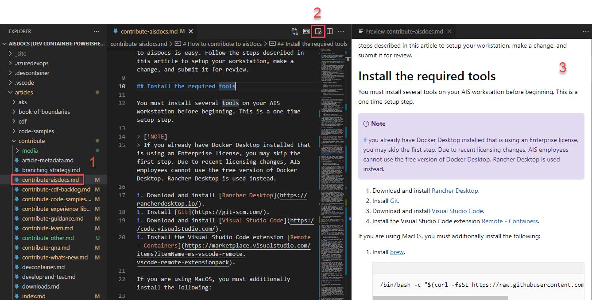

# Preview your content

When developing content for PACE Docs you should make a habit of reviewing your changes as rendered markdown continually throughout the authoring process. There are two ways to preview your changes on your workstation.

## Visual Studio Code markdown preview

1. Open any markdown files in Visual Studio Code.
1. Click the **Open preview to side** button in the top right corner of the file.
1. As you edit markdown on the page, the preview will update in real time.

   
