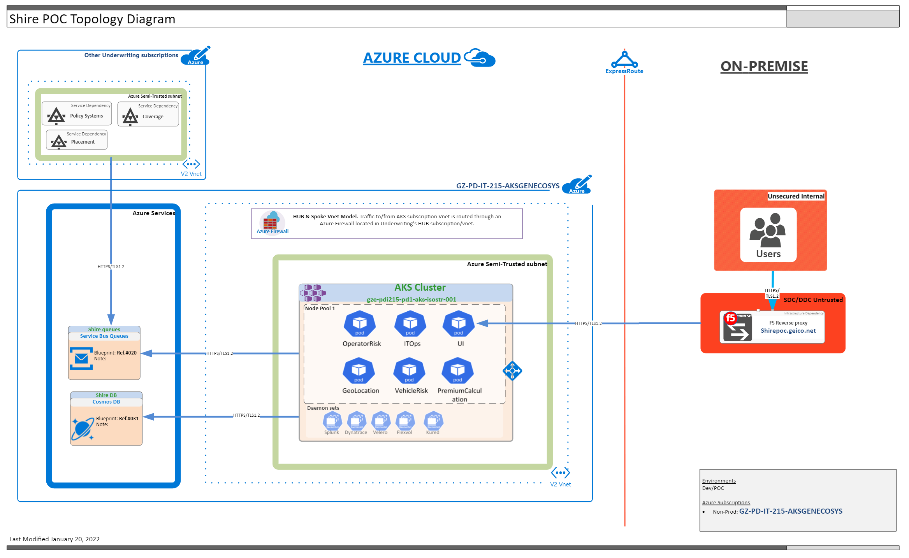

# Getting started
_Article to help developer configure their machine for development_

[[_TOC_]]

## Topology

|                                        |
|:----------------------------------------------------------------------:|
|*Image: Topology of application |
Test

Dev Setup - NOT COMPLETE PLACEHOLDER
Cosmos Emulator
Service Bus Explorer